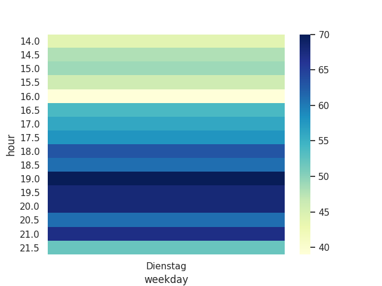

# Steibock Konstanz visitors in Corona times
Time slot analysis for Steinbock Konstanz // visitor capacity development over the course a week.
Keep in mind there are factory like the weather that do influence the amount of visitors. 

In `files/` is a collection of the current visitor count for every 30 minutes for currently ~ 2 weeks. There are a few missing times.

## Possible todos: 
 - [ ] Provide web-interface via flask?
 - [ ] Add weather dimensions
 - [ ] Baysian classifier to predict future capacity

## A few results
### After a few hours
  

### After ~ 2 weeks

